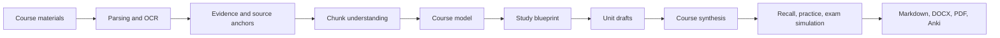

# RecallForge AI

<div align="center">

**AI-native exam review & active learning workspace**

Turn course materials into evidence-grounded study plans, active recall, adaptive practice, and exam-ready outputs.

[](https://github.com/SiriZhao/recallforge-ai/actions/workflows/ci.yml)
[](https://github.com/SiriZhao/recallforge-ai/releases/latest)
[](LICENSE)
[](backend/requirements.txt)
[](frontend/package.json)
[](backend/requirements.txt)
[](docs/windows-desktop.md)

[Download](https://github.com/SiriZhao/recallforge-ai/releases/latest) · [Quick Start](#quick-start) · [Documentation](#documentation) · [Contributing](CONTRIBUTING.md) · [简体中文](README.zh-CN.md)

</div>


## What is RecallForge AI?

RecallForge AI is an open-source workspace for university students preparing for exams. It takes course materials, reconstructs the knowledge and evidence inside them, and turns that understanding into a review plan, active-recall practice, weakness signals, exam simulation, and exportable study packs.

It is designed for the journey from material understanding to exam-ready learning:

```text
Course materials
  → Parsing & OCR
  → Evidence and knowledge reconstruction
  → Course model and study blueprint
  → LLM-authored review
  → Recall, practice, and weakness detection
  → Exam simulation
  → Markdown / DOCX / PDF / Anki exports
```

RecallForge AI is v0.6.0 and under active development. Generated content is a study aid: check it against the original materials and your instructor's requirements.

## Why RecallForge?

A chat-with-PDF tool is often summary-centric, single-document, and one-shot. RecallForge focuses on the learning loop around an exam:

| Focus | RecallForge AI |
| --- | --- |
| Multiple materials | Combine syllabi, slides, notes, textbooks, past papers, answers, and mistakes |
| Evidence grounding | Preserve source anchors, coverage diagnostics, and unresolved material |
| Knowledge reconstruction | Build a course model and study blueprint before writing the study pack |
| Active recall | Generate recall questions, flashcards, checkpoints, and practice |
| Weakness detection | Surface gaps, risks, and topics that need another pass |
| Exam orientation | Use exam type, goals, and past-paper signals to shape practice |
| Iteration | Track asynchronous jobs and retry or repair a bounded unit |
| Portable output | Export canonical Markdown to DOCX/PDF and Anki CSV |

## Core capabilities and status

| Capability | Status | What is available |
| --- | --- | --- |
| Multi-material parsing | Stable | PDF, scanned-PDF OCR path, PPTX, DOCX, Markdown, TXT, PNG/JPG/JPEG |
| Evidence and knowledge reconstruction | Available | Structured document blocks, source anchors, Course Model, Study Blueprint |
| LLM-first review generation | Available | Staged chunk understanding, course synthesis, unit drafts, canonical Markdown |
| Active recall and flashcards | Available | Recall questions, Anki cards, learning checkpoints |
| Weakness and material diagnosis | Available | Completeness, missing-material and risk signals |
| Adaptive practice and mock exam | Available | Practice questions and exam-mode question sets |
| Past-paper analysis | Available | Exam patterns and frequently observed topics when evidence exists |
| Export | Stable | Markdown, DOCX, PDF, and Anki CSV |
| Automatic critic-to-repair orchestration | Experimental | Bounded unit repair exists; full automatic orchestration is still evolving |
| Multimodal understanding | Planned | Richer image and multimodal reasoning beyond the current OCR/provider paths |

## See it in action

The screenshot above is captured from the running v0.6.0 React/Vite application with an empty, privacy-safe workspace. It shows the real home flow and supported upload surface. Additional workflow views are documented in the [UI implementation report](UI_IMPLEMENTATION_REPORT.md); screenshots of states requiring a populated LLM result are added only when they can be captured from the real application without fabricated data.

## Supported inputs and outputs

### Inputs

| Input | Handling |
| --- | --- |
| PDF | Text-layer parsing; low-text/scanned pages can use OCR |
| PPTX | Slide text, native tables, images, and slide anchors |
| DOCX | Paragraphs, native tables, images, and document anchors |
| Markdown / TXT | Text and heading-aware structure analysis |
| PNG / JPG / JPEG | OCR candidate images |

OCR providers currently include RapidOCR, optional local Tesseract, OpenAI vision, custom API, and Baidu OCR adapters. Availability depends on installed packages and provider configuration.

### Outputs

- Canonical Markdown study report
- DOCX study report
- PDF study report
- Anki CSV cards
- In-app knowledge map, recall cards, practice questions, and mock-exam views

## Typical workflow

1. Create a course workspace and set the exam type, study goal, and available time.
2. Add a syllabus, slides, notes, textbook extracts, past papers, or other permitted materials.
3. Review parsed files and assign each file a role.
4. Run the material diagnosis to see coverage, gaps, and risks.
5. Generate a study blueprint and review pack with the configured LLM, or use the explicit offline fallback.
6. Practice with recall cards, questions, weakness signals, and exam-mode sets.
7. Export the canonical report to Markdown, DOCX, PDF, or Anki CSV.

## Quick start

Choose the path that fits your use case.

### A. Windows — download and run

The easiest path is the [v0.6.0 release](https://github.com/SiriZhao/recallforge-ai/releases/tag/v0.6.0).

1. Download `ExamForgeAISetup-0.6.0.exe`.
2. Install and launch **RecallForge AI**.
3. Open **Model settings** and configure a provider if you want LLM-first generation.
4. Create a course workspace, add materials, review the diagnosis, and start generation.

The installer and executable still use the compatibility names `ExamForgeAISetup-0.6.0.exe` and `ExamForgeAI.exe`. They are the RecallForge AI v0.6.0 desktop build.

### B. Local development

Backend:

```powershell
cd backend
python -m venv .venv
.\.venv\Scripts\Activate.ps1
python -m pip install -r requirements.txt
python -m uvicorn app.main:app --reload --port 8000
```

In a second terminal, frontend:

```powershell
cd frontend
npm ci
$env:VITE_API_BASE_URL="http://127.0.0.1:8000/api"
npm run dev
```

Open the Vite URL, normally <http://localhost:5173>. The backend health endpoint is <http://127.0.0.1:8000/api/health>.

On macOS/Linux, use `python3 -m venv .venv`, `source .venv/bin/activate`, and `export VITE_API_BASE_URL=http://127.0.0.1:8000/api`.

### C. Docker

```bash
docker build -t recallforge-ai:0.6.0 .
docker run --rm -p 8000:8000 --env-file .env.example -v examforge_data:/data recallforge-ai:0.6.0
```

Check <http://127.0.0.1:8000/api/health>. The `examforge_data` volume name is retained for existing deployments; it is a storage compatibility identifier, not the current product name. For cloud configuration, see [Cloud deployment](docs/cloud-deployment.md).

## LLM-first architecture

LLM-first means the model owns semantic interpretation, course organization, explanations, and canonical study writing. Deterministic local code remains responsible for parsing, OCR coordination, source anchors, validation, persistence, job checkpoints, exports, and the explicit offline fallback.

The active AI path is staged:



A provider failure does not silently turn a successful AI result into filler. Failed or unresolved stages are recorded; a complete pipeline failure can enter the clearly labelled Basic Offline Review path.

## LLM configuration and privacy

The web UI accepts:

- Provider: DeepSeek, OpenAI, or OpenAI-compatible
- Base URL
- Model name
- API key

The backend also has adapters for Qwen, custom OpenAI-compatible endpoints, and test/mock providers. Provider availability and model access depend on your account and endpoint.

The API key is stored in the current browser's `localStorage` when you choose **Save**. It is sent with generation requests to the RecallForge backend, which uses it for the selected provider and does not persist it in the workspace database or application logs. Do not use a shared browser profile for sensitive keys.

Materials leave the device only when you invoke an external LLM or OCR provider, or when you deploy the cloud mode yourself. Local/desktop parsing and offline review can run without an LLM key. Review [Privacy](docs/privacy.md), [Security](docs/security.md), and [LLM providers](docs/llm-providers.md) before uploading restricted course material.

## Architecture and tech stack

The detailed component view is in [docs/architecture.md](docs/architecture.md).

| Layer | Technologies |
| --- | --- |
| Frontend | React 19, TypeScript, Vite, Vitest |
| Backend | Python, FastAPI, Pydantic Settings, SQLAlchemy/SQLite |
| LLM | OpenAI-compatible chat-completions adapters, DeepSeek/OpenAI/Qwen paths |
| Documents | pypdf, python-pptx, python-docx, Markdown, Pillow |
| OCR | RapidOCR, optional Tesseract, vision/custom/Baidu adapters |
| Exports | Markdown, python-docx, ReportLab/WeasyPrint, Anki CSV |
| Desktop | PyInstaller and Inno Setup |
| Delivery | Docker and GitHub Actions |

## Project structure

```text
recallforge-ai/
├── backend/       FastAPI API, parsing/OCR, generation pipeline, storage, exports, tests
├── frontend/      React/Vite workspace and report UI
├── docs/          User, deployment, architecture, privacy, and provider guides
├── examples/      Fictional demo materials and example outputs
├── installer/     Windows installer and version metadata
├── scripts/       Development, diagnostics, testing, and packaging helpers
├── .github/       CI, release workflow, issue templates, and PR template
├── Dockerfile
├── VERSION
└── README.md
```

## Documentation

| Topic | Guide |
| --- | --- |
| Configuration | [docs/configuration.md](docs/configuration.md) |
| LLM providers | [docs/llm-providers.md](docs/llm-providers.md) |
| OCR providers | [docs/ocr-providers.md](docs/ocr-providers.md) |
| Architecture | [docs/architecture.md](docs/architecture.md) |
| Development | [docs/development.md](docs/development.md) |
| Deployment | [docs/deployment.md](docs/deployment.md) |
| Cloud deployment | [docs/cloud-deployment.md](docs/cloud-deployment.md) |
| Export | [docs/export.md](docs/export.md) |
| Anki | [docs/anki.md](docs/anki.md) |
| User guide | [docs/user-guide.md](docs/user-guide.md) |
| Release notes | [RELEASE_NOTES_v0.6.0.md](RELEASE_NOTES_v0.6.0.md) |
| Contributing | [CONTRIBUTING.md](CONTRIBUTING.md) |
| Security | [SECURITY.md](SECURITY.md) |

## Development and testing

From the repository root:

```powershell
python -m pytest backend
cd frontend
npm ci
npm run test -- --run
npm run lint
npm run typecheck
npm run build
```

The CI workflow runs backend tests, frontend tests, and the frontend build. The Windows release workflow additionally packages the desktop executable and installer.

## Contributing and community

Contributions are welcome in bug fixes, documentation, UI/UX, parsers, OCR adapters, LLM provider adapters, exports, tests, evaluation fixtures, accessibility, and internationalization.

Read [CONTRIBUTING.md](CONTRIBUTING.md) before opening a pull request. Please use the issue templates for bugs, features, or documentation corrections. Never include API keys, private course materials, databases, or user uploads in issues or pull requests. For vulnerabilities, follow [SECURITY.md](SECURITY.md).

## Project status

- Current release: **v0.6.0**
- Development stage: active v0.x development
- Important data: back up local workspaces before upgrades
- Model output: always review against source material

### Roadmap

**Near-term**

- Richer multimodal material understanding
- Stronger active-recall loops and weakness modelling
- More regression and evaluation fixtures
- Additional export formats

**Longer-term**

- Adaptive difficulty
- Cross-platform packaging improvements
- Agent and skill integrations

There are no promised delivery dates.

## FAQ

### Does RecallForge require an LLM?

No. Basic Offline Review can parse materials and produce a deterministic fallback. LLM-first mode is the main product path for semantic reconstruction and richer study writing.

### Which models can I use?

The UI supports DeepSeek, OpenAI, and OpenAI-compatible endpoints. You provide the model name and Base URL. Qwen and custom provider adapters also exist in the backend.

### Are my materials uploaded?

Local/desktop mode keeps runtime data on the configured machine unless you call an external provider. Cloud mode processes data on the server you deploy and applies its configured TTL cleanup.

### Where is my API key stored?

The browser stores the saved BYOK configuration in `localStorage`. The backend uses the key for requests but does not persist it in the workspace database or logs.

### Can I use scanned PDFs?

Yes, when an OCR provider is available. Text-layer PDFs skip unnecessary OCR; scanned or low-text pages can use the configured OCR path.

### Can I export to Anki?

Yes. Generated Anki cards can be downloaded as CSV alongside Markdown, DOCX, and PDF outputs.

### Why is the Windows binary still named ExamForgeAI?

The executable and installer names are retained as compatibility identifiers for existing installations and release automation. The product and repository are RecallForge AI.

### Is RecallForge AI production-ready?

It is a usable v0.x open-source project under active development. Expect iteration, back up important workspaces, and verify generated content.

## Project evolution

RecallForge AI evolved from earlier ExamForge AI and Campus AI Workspace iterations. Those names remain only in historical release notes and compatibility identifiers; the current product branding is RecallForge AI.

## Release and license

- [Latest GitHub Release](https://github.com/SiriZhao/recallforge-ai/releases/latest)
- [v0.6.0 release notes](RELEASE_NOTES_v0.6.0.md)
- [MIT License](LICENSE)

If RecallForge AI is useful to you, consider [starring the repository](https://github.com/SiriZhao/recallforge-ai). It helps other students and contributors discover the project.
