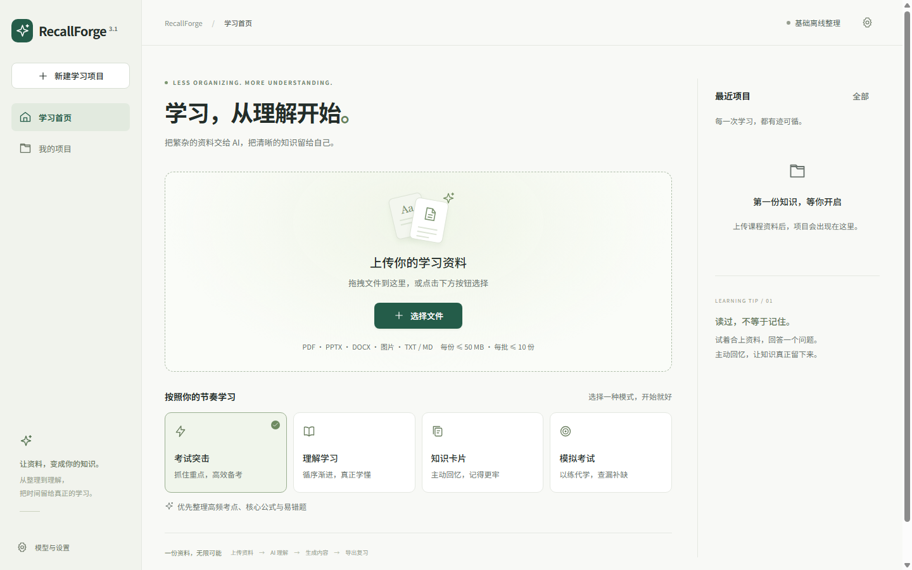
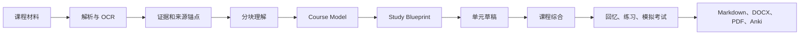

# RecallForge AI

<div align="center">

**AI 原生考试复习与主动学习工作台**

把课程材料转化为有证据依据的复习计划、主动回忆、适应性练习和面向考试的学习成果。

[](https://github.com/SiriZhao/recallforge-ai/actions/workflows/ci.yml)
[](https://github.com/SiriZhao/recallforge-ai/releases/latest)
[](LICENSE)
[](backend/requirements.txt)
[](frontend/package.json)
[](backend/requirements.txt)
[](docs/windows-desktop.md)

[下载](https://github.com/SiriZhao/recallforge-ai/releases/latest) · [快速开始](#快速开始) · [文档](#文档) · [参与贡献](CONTRIBUTING.md) · [English](README.md)

</div>



## RecallForge AI 是什么？

RecallForge AI 是面向大学课程和期末考试的开源学习工作台。它读取课程材料，重建其中的知识与证据，再生成复习计划、主动回忆练习、薄弱点提示、模拟考试和可导出的学习包。

它连接的是一条完整学习路径：

```text
课程材料
  → 解析与 OCR
  → 证据和知识重建
  → Course Model 与 Study Blueprint
  → LLM 生成复习内容
  → 主动回忆、练习和薄弱点识别
  → 模拟考试
  → Markdown / DOCX / PDF / Anki 导出
```

当前正式版本是 v0.6.0，项目仍处于活跃的 v0.x 开发阶段。生成内容是学习辅助工具，请结合原始材料和教师要求复核。

## 为什么使用 RecallForge？

普通的“把 PDF 发给聊天机器人”通常以单文档、一次性总结为主。RecallForge 更关注考试复习闭环：

| 关注点 | RecallForge AI |
| --- | --- |
| 多材料理解 | 合并课程大纲、课件、笔记、教材、往年题、答案和错题 |
| 证据约束 | 保留来源锚点、覆盖诊断和未解决材料 |
| 知识重建 | 先形成课程模型和学习蓝图，再撰写复习资料 |
| 主动回忆 | 生成回忆题、闪卡、检查点和练习 |
| 薄弱点识别 | 展示资料缺口、风险和需要再次复习的主题 |
| 面向考试 | 使用考试形式、学习目标和往年题信号塑造练习 |
| 迭代生成 | 追踪异步任务，并支持有限范围的重试和修复 |
| 可携带输出 | 导出 Markdown、DOCX、PDF 和 Anki CSV |

## 核心能力与状态

| 能力 | 状态 | 当前实现 |
| --- | --- | --- |
| 多材料解析 | 稳定 | PDF、扫描 PDF OCR 路径、PPTX、DOCX、Markdown、TXT、PNG/JPG/JPEG |
| 证据和知识重建 | 可用 | 文档块、来源锚点、Course Model、Study Blueprint |
| LLM-first 复习生成 | 可用 | 分块理解、课程综合、单元草稿和 canonical Markdown |
| 主动回忆与闪卡 | 可用 | 回忆题、Anki 卡片、学习检查点 |
| 薄弱点和资料诊断 | 可用 | 完整度、缺失材料和风险信号 |
| 适应性练习与模拟考试 | 可用 | 练习题和考试模式题集 |
| 往年题分析 | 可用 | 在存在相关证据时分析高频主题和题型 |
| 导出 | 稳定 | Markdown、DOCX、PDF、Anki CSV |
| 自动 critic-to-repair 编排 | 实验性 | 有限单元修复可用，完整自动编排仍在演进 |
| 更丰富的多模态理解 | 计划中 | 超出当前 OCR/provider 路径的图像和多模态推理 |

## 支持的输入和输出

输入包括 PDF、低文本/扫描 PDF、PPTX、DOCX、Markdown、TXT 以及 PNG/JPG/JPEG 图片。OCR provider 包括 RapidOCR、可选的本地 Tesseract、OpenAI vision、自定义 API 和百度 OCR adapter，实际可用性取决于依赖和配置。

输出包括 canonical Markdown、DOCX、PDF、Anki CSV，以及应用内知识地图、回忆卡、练习题和模拟考试视图。

## 典型流程

1. 创建课程工作空间，填写考试形式、学习目标和可用时间。
2. 添加课程大纲、课件、笔记、教材节选、往年题等有权使用的材料。
3. 查看解析结果并为文件指定用途。
4. 运行资料诊断，查看完整度、缺口和风险。
5. 配置 LLM 后生成学习蓝图和复习包；没有 LLM 时使用明确标注的离线 fallback。
6. 使用回忆卡、练习题、薄弱点提示和模拟考试进行复习。
7. 将 canonical 报告导出为 Markdown、DOCX、PDF 或 Anki CSV。

## 快速开始

### A. Windows 下载运行

推荐直接使用 [v0.6.0 Release](https://github.com/SiriZhao/recallforge-ai/releases/tag/v0.6.0)：

1. 下载 `ExamForgeAISetup-0.6.0.exe`。
2. 安装并启动 **RecallForge AI**。
3. 打开“模型与设置”，按需配置 LLM provider。
4. 创建课程工作空间，添加材料，查看诊断并开始生成。

安装器和可执行文件仍使用 `ExamForgeAISetup-0.6.0.exe` 与 `ExamForgeAI.exe` 这两个兼容名称；它们就是 RecallForge AI v0.6.0 桌面版。

### B. 本地开发

后端：

```powershell
cd backend
python -m venv .venv
.\.venv\Scripts\Activate.ps1
python -m pip install -r requirements.txt
python -m uvicorn app.main:app --reload --port 8000
```

另开终端启动前端：

```powershell
cd frontend
npm ci
$env:VITE_API_BASE_URL="http://127.0.0.1:8000/api"
npm run dev
```

打开通常为 <http://localhost:5173> 的 Vite 地址；后端健康检查为 <http://127.0.0.1:8000/api/health>。macOS/Linux 使用 `python3 -m venv .venv`、`source .venv/bin/activate` 和 `export VITE_API_BASE_URL=http://127.0.0.1:8000/api`。

### C. Docker

```bash
docker build -t recallforge-ai:0.6.0 .
docker run --rm -p 8000:8000 --env-file .env.example -v examforge_data:/data recallforge-ai:0.6.0
```

打开 <http://127.0.0.1:8000/api/health> 检查服务。卷名 `examforge_data` 是既有部署的存储兼容标识，不是当前产品名称。更多内容见 [云端部署](docs/cloud-deployment.md)。

## LLM-first 架构

LLM-first 表示模型负责语义理解、课程组织、解释和 canonical 学习资料写作；本地确定性代码负责解析、OCR 调度、来源锚点、校验、持久化、任务 checkpoint、导出和明确的离线 fallback。

当前 pipeline 为：



provider 失败不会把成功的 AI 结果静默替换成填充内容。失败或未解决阶段会被记录；完整 pipeline 失败时才会进入明确标注的 Basic Offline Review。

## LLM 配置与隐私

网页界面接受 Provider、Base URL、模型名称和 API Key，UI 目前提供 DeepSeek、OpenAI 和 OpenAI-compatible 选项。后端还包含 Qwen、自定义 OpenAI-compatible 和测试/mock provider adapter，实际模型访问取决于账户和 endpoint。

点击“保存”后，BYOK 配置保存在当前浏览器的 `localStorage`。生成时 Key 会随请求发送给 RecallForge 后端，由后端调用所选 provider；不会写入工作空间数据库或应用日志。不要在共享浏览器配置敏感 Key。

只有在调用外部 LLM/OCR provider，或你自行部署 cloud 模式时，材料才会离开本机。请阅读 [隐私说明](docs/privacy.md)、[安全说明](docs/security.md) 和 [LLM Providers](docs/llm-providers.md)。

## 架构与技术栈

完整组件说明见 [docs/architecture.md](docs/architecture.md)。

| 层 | 技术 |
| --- | --- |
| 前端 | React 19、TypeScript、Vite、Vitest |
| 后端 | Python、FastAPI、Pydantic Settings、SQLAlchemy/SQLite |
| LLM | OpenAI-compatible chat-completions adapter、DeepSeek/OpenAI/Qwen 路径 |
| 文档 | pypdf、python-pptx、python-docx、Markdown、Pillow |
| OCR | RapidOCR、可选 Tesseract、vision/custom/Baidu adapter |
| 导出 | Markdown、python-docx、ReportLab/WeasyPrint、Anki CSV |
| 桌面端 | PyInstaller、Inno Setup |
| 交付 | Docker、GitHub Actions |

## 项目结构

```text
recallforge-ai/
├── backend/       FastAPI API、解析/OCR、生成 pipeline、存储、导出和测试
├── frontend/      React/Vite 工作区和报告界面
├── docs/          用户、部署、架构、隐私和 provider 文档
├── examples/      虚构 demo 材料和示例输出
├── installer/     Windows 安装器和版本信息
├── scripts/       开发、诊断、测试和打包脚本
├── .github/       CI、release workflow、Issue 模板和 PR 模板
├── Dockerfile
├── VERSION
└── README.md
```

## 文档

| 主题 | 指南 |
| --- | --- |
| 配置 | [docs/configuration.md](docs/configuration.md) |
| LLM Provider | [docs/llm-providers.md](docs/llm-providers.md) |
| OCR Provider | [docs/ocr-providers.md](docs/ocr-providers.md) |
| 架构 | [docs/architecture.md](docs/architecture.md) |
| 开发 | [docs/development.md](docs/development.md) |
| 部署 | [docs/deployment.md](docs/deployment.md) |
| 云端部署 | [docs/cloud-deployment.md](docs/cloud-deployment.md) |
| 导出 | [docs/export.md](docs/export.md) |
| Anki | [docs/anki.md](docs/anki.md) |
| 用户指南 | [docs/user-guide.md](docs/user-guide.md) |
| Release notes | [RELEASE_NOTES_v0.6.0.md](RELEASE_NOTES_v0.6.0.md) |
| 贡献指南 | [CONTRIBUTING.md](CONTRIBUTING.md) |
| 安全 | [SECURITY.md](SECURITY.md) |

## 开发与测试

仓库根目录执行：

```powershell
python -m pytest backend
cd frontend
npm ci
npm run test -- --run
npm run lint
npm run typecheck
npm run build
```

CI 会运行后端测试、前端测试和前端构建；Windows release workflow 还会打包桌面可执行文件和安装器。

## 贡献与社区

欢迎参与 bug 修复、文档、UI/UX、解析器、OCR adapter、LLM provider adapter、导出格式、测试、评估样例、无障碍和国际化。提交 PR 前请阅读 [CONTRIBUTING.md](CONTRIBUTING.md)，问题请使用 Issue 模板。不要在 Issue 或 PR 中提交 API Key、私人课程材料、数据库或用户上传文件。安全问题请遵循 [SECURITY.md](SECURITY.md)。

## 项目状态与 Roadmap

当前版本：**v0.6.0**。项目处于活跃的 v0.x 开发阶段，升级前请备份重要工作空间，并始终复核模型输出。

**近期**

- 更丰富的多模态材料理解
- 更强的主动回忆闭环和薄弱点建模
- 更多回归和评估样例
- 更多导出格式

**长期**

- 自适应难度
- 跨平台打包改进
- Agent 与 skill 集成

不承诺具体交付日期。

## FAQ

### RecallForge 必须使用 LLM 吗？

不必须。Basic Offline Review 可以解析材料并生成确定性的 fallback；LLM-first 模式是语义重建和高质量学习资料写作的主要路径。

### 支持哪些模型？

UI 支持 DeepSeek、OpenAI 和 OpenAI-compatible endpoint，由用户提供模型名称和 Base URL。后端还包含 Qwen 和自定义 provider adapter。

### 材料会被上传吗？

本地/桌面模式将运行时数据保存在配置的机器上，除非你调用外部 provider。Cloud 模式会在你部署的服务器上处理数据，并按配置清理临时文件。

### API Key 保存在哪里？

保存后的 BYOK 配置位于浏览器 `localStorage`。后端只在请求期间使用 Key，不将其写入工作空间数据库或日志。

### 支持扫描 PDF 吗？

支持，前提是 OCR provider 可用。有文本层的 PDF 会跳过不必要的 OCR；扫描或低文本页面可走配置的 OCR 路径。

### 能导出到 Anki 吗？

可以。生成的 Anki cards 可导出 CSV，同时支持 Markdown、DOCX 和 PDF。

### 为什么 Windows 文件仍叫 ExamForgeAI？

可执行文件和安装器名称作为既有安装和 release 自动化的兼容标识保留；产品和仓库现在都是 RecallForge AI。

### RecallForge AI 已经适合生产环境吗？

这是一个可使用但仍在快速演进的 v0.x 开源项目。请备份本地工作空间，并核对所有生成内容。

## 项目演进、Release 与许可证

RecallForge AI 演进自早期 ExamForge AI 和 Campus AI Workspace；这些名称只保留在历史 release notes 和兼容标识中。

- [最新 GitHub Release](https://github.com/SiriZhao/recallforge-ai/releases/latest)
- [v0.6.0 Release notes](RELEASE_NOTES_v0.6.0.md)
- [MIT License](LICENSE)

如果 RecallForge AI 对你有帮助，欢迎[给仓库点 Star](https://github.com/SiriZhao/recallforge-ai)，帮助更多学习者和贡献者发现它。
