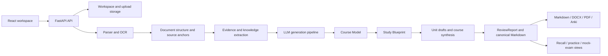

# RecallForge AI architecture

RecallForge AI is a React/Vite workspace backed by a FastAPI service. The v0.6.0 architecture keeps semantic writing flexible for the LLM while keeping file handling, evidence, persistence, validation, and exports inspectable and deterministic.

## System flow

## Frontend

The frontend uses React 19, TypeScript, Vite, and Vitest. useReviewWorkspace coordinates workspace initialization, uploads, material roles, diagnosis, asynchronous generation jobs, recovery, and local browser state. Pages cover the dashboard, materials, diagnosis, processing, projects, and results.

The UI stores BYOK configuration in browser localStorage under a legacy compatibility key. Workspace identifiers and resumable job references also use browser storage; this is not a server-side credential store.

## Backend

The backend uses FastAPI routers for health, workspace projects, uploads, parsing, diagnosis, generation jobs, LLM configuration, downloads, exports, and mock exams. SQLite/SQLAlchemy persist workspace metadata, parsed material metadata, generation checkpoints, reports, and versions. Runtime uploads, outputs, OCR cache, and diagnostics remain in configured runtime directories.

## Parsing, OCR, and evidence

file_parser.py handles PDF, PPTX, DOCX, Markdown, TXT, and image inputs. Text-layer PDF pages avoid unnecessary OCR. OCR providers include RapidOCR, optional Tesseract, OpenAI vision, custom API, and Baidu OCR adapters. The parser retains page/slide anchors, blocks, tables, images, warnings, and OCR cache information.

Structure analysis and knowledge extraction feed evidence packs into the generation pipeline. Unresolved pages or chunks remain explicit diagnostics instead of silently becoming invented content.

## LLM generation

Normal AI mode uses staged provider calls for chunk understanding, course modelling, study blueprint creation, unit drafting, and course synthesis. The model owns semantic interpretation and canonical study writing. Python owns prompt budgets, retries, checkpoints, provider errors, source references, validation, and persistence.

The UI exposes DeepSeek, OpenAI, and OpenAI-compatible configuration. The backend also contains Qwen, custom, and mock adapters. If the AI path cannot complete, the application reports the failure and may enter the explicitly labelled Basic Offline Review fallback.

## Storage and privacy

The browser holds the saved BYOK configuration. Generation requests carry the key to the backend, which uses it for the selected provider and does not persist it in the workspace database or logs. Course material is sent to an external provider only when the user invokes that provider or deploys cloud mode.

Desktop/local mode keeps runtime data on the configured machine. Cloud mode uses anonymous workspace identifiers and configured temporary-file cleanup. See [Privacy](privacy.md), [Security](../SECURITY.md), and [Cloud deployment](cloud-deployment.md).

## Exports and desktop packaging

Canonical Markdown is the source for Markdown, DOCX, and PDF exports; Anki cards are emitted as CSV. The Windows build uses PyInstaller and Inno Setup. ExamForgeAI.exe, the ExamForgeAI local-data directory, and the installer filename are retained compatibility identifiers for existing installations.
